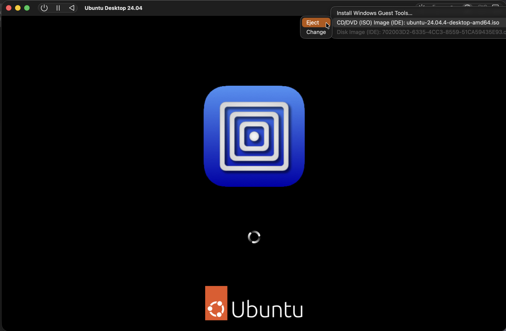
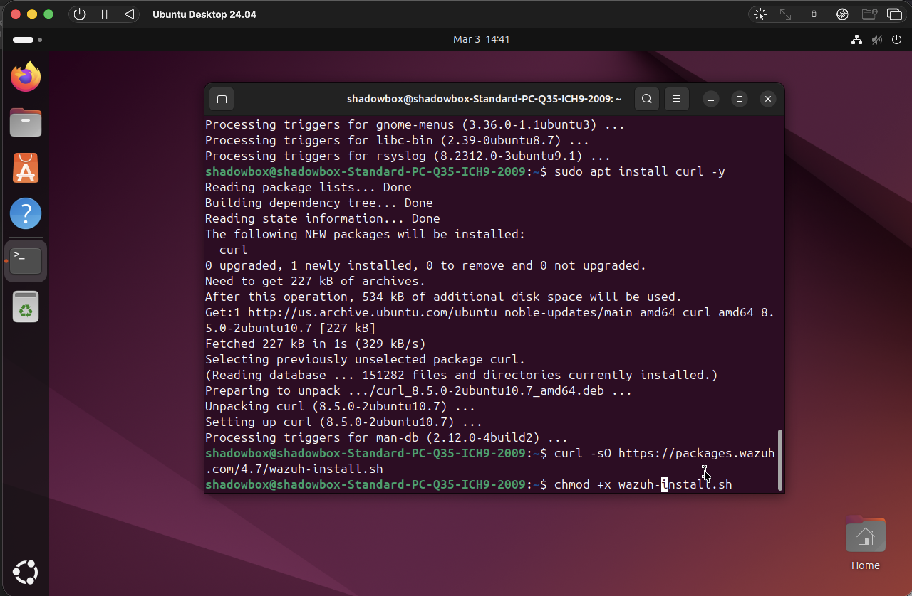

# Wazuh Installation Guide (Phase 1)

## Objective

Deploy **Wazuh SIEM** on an Ubuntu 24.04 virtual machine to function as the centralized security monitoring platform for the Phase 1 SOC lab environment.

Wazuh is an open-source security platform used for threat detection, log analysis, intrusion detection, vulnerability monitoring, and compliance auditing.

Wazuh provides:

- Security Information and Event Management (SIEM)
- Intrusion detection
- File integrity monitoring
- Log analysis
- Security configuration assessment

## Lab Environment

| Component | Configuration |
|-----------|--------------|
| Host System | Apple Silicon Mac |
| Virtualization Platform | UTM |
| VM Mode | Emulation |
| Guest OS | Ubuntu 24.04 Desktop |
| SIEM Platform | Wazuh 4.7 |
| RAM | 8 GB |
| CPU | 4 Cores |
| Disk | 100 GB |

**Note**

Because this lab was completed on **Apple Silicon**, the Ubuntu virtual machine was created using **UTM Emulation Mode** instead of virtualization.

## Lab Architecture

```text
Apple Silicon Mac
      │
      ▼
UTM Virtual Machine (Emulated)
      │
      ▼
Ubuntu 24.04 Desktop
      │
      ▼
Wazuh Manager + Indexer + Dashboard
      │
      ▼
Wazuh Web Interface
```

## Installation Steps

### 1. Download Ubuntu ISO

Download the Ubuntu Desktop ISO.

Example file used in this lab:

```text
ubuntu-24.04.4-desktop-amd64.iso
```


### 2. Create Virtual Machine in UTM

Open **UTM** and create a new virtual machine.

Select:

```text
Emulate
```

Then choose:

```text
Linux
```

Attach the Ubuntu ISO file.

VM configuration used for this lab:

```text
RAM: 8192 MB
CPU: 4 cores
Disk: 100 GB
Architecture: x86_64
```


### 3. Boot Ubuntu Installer

Start the virtual machine.

When the Ubuntu boot menu appears, select:

```text
Try or Install Ubuntu
```


### 4. Configure Ubuntu Installation

Follow the Ubuntu installation wizard.

Recommended selections:

Language:

```text
English
```

Keyboard:

```text
English (US)
```

Network:

```text
Use Wired Connection
```

Installation type:

```text
Install Ubuntu
```

Installation mode:

```text
Interactive Installation
```

Application selection:

```text
Default Selection
```

Disk setup:

```text
Erase Disk and Install Ubuntu
```


### 5. Create Ubuntu User

Create a user account.

Example configuration used in the lab:

```text
Username: shadowbox
Computer Name: wazuh-server
Password: ********
```

Select the correct time zone.

Example:

```text
America / Los Angeles
```


### 6. Review Installation Settings and Complete Ubuntu Installation

Review the installation summary before proceeding.

Ubuntu will then begin copying files and installing the operating system.

When installation finishes:

- Select **Restart Now**
- Remove the installation medium when prompted
- Press **Enter** to reboot




### 7. Log Into Ubuntu

After the system reboots, log into Ubuntu using the user account created earlier.

Once logged in, complete the first-boot welcome screen.


### 8. Update the System

Open a terminal and update the system.

```bash
sudo apt update && sudo apt upgrade -y
```

This updates package repositories and installs the latest system updates.


### 9. Install Curl

Curl is required to download the Wazuh installer.

```bash
sudo apt install curl -y
```


### 10. Download the Wazuh Installer

Download the official Wazuh installation script.

```bash
curl -sO https://packages.wazuh.com/4.7/wazuh-install.sh
```


### 11. Make the Installer Executable

Give the script execution permissions.

```bash
chmod +x wazuh-install.sh
```



### 12. Run the Wazuh Installer

Run the Wazuh all-in-one installer.

```bash
sudo ./wazuh-install.sh -a
```

This installs:

- Wazuh Manager
- Wazuh Indexer
- Filebeat
- Wazuh Dashboard

If Ubuntu 24.04 triggers a compatibility warning, rerun the installer using:

```bash
sudo ./wazuh-install.sh -a -i
```

This bypasses the operating system compatibility check.


### 13. Save Dashboard Credentials

At the end of installation, the terminal displays dashboard credentials.

Example output:

```text
User: admin
Password: <generated password>
```

Save the password because it is required to access the Wazuh dashboard.


### 14. Find the Server IP Address

Run:

```bash
ip a
```

Locate the active network interface and identify the assigned IPv4 address.

Example:

```text
192.168.64.15
```


### 15. Access the Wazuh Dashboard

Open a browser and navigate to:

```text
https://<server-ip>
```

Example:

```text
https://192.168.64.15
```

Because Wazuh uses a self-signed certificate, the browser may display a warning.

Select:

```text
Advanced → Proceed
```


### 16. Log Into Wazuh

Enter the credentials generated during installation.

```text
Username: admin
Password: <generated password>
```

The Wazuh login page should appear first, followed by the dashboard after successful authentication.


### 17. Verify Dashboard Access

After successful authentication, the Wazuh dashboard loads and displays the monitoring interface.


## Wazuh Components Installed

The Wazuh installation script deploys the following components:

- **Wazuh Manager** – Processes and analyzes security events
- **Wazuh Indexer** – Stores security logs and indexed events
- **Filebeat** – Forwards logs to the indexer
- **Wazuh Dashboard** – Provides the web interface for monitoring and analysis

## Verification

A successful installation displays the Wazuh dashboard modules, including:

- Security Events
- Integrity Monitoring
- Policy Monitoring
- System Auditing
- Security Configuration Assessment

Initially the dashboard will show:

```text
Total Agents: 0
```

This is expected until monitored endpoints are added to the Wazuh manager.

## Result

The Wazuh SIEM platform has been successfully deployed and is ready to monitor endpoints within the SOC lab environment.

Future steps include:

- Installing Wazuh agents
- Connecting endpoints to the manager
- Generating security alerts
- Monitoring logs and security events
